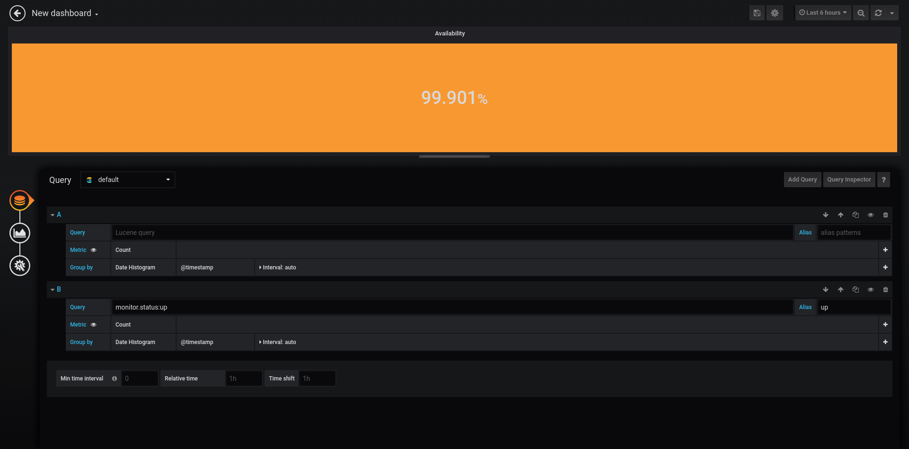

# Grafana percent+ stat panel

Simply computes and display percent given two metric.

Design with heartbeat in minds, it aims to display an availability rate. 
But you can give it any metric in input to compute your own percent rate.

## Usage

 1. Query two metrics



 2. Use them to display your availability rate


## Install

Download release and unzip it in your grafana plugin folder.

## Contibute

To work with this plugin run:
```
yarn dev
```

or
```
yarn watch
```

This will run linting tools and apply prettier fix.


To build the plugin run:
```
yarn build
```
